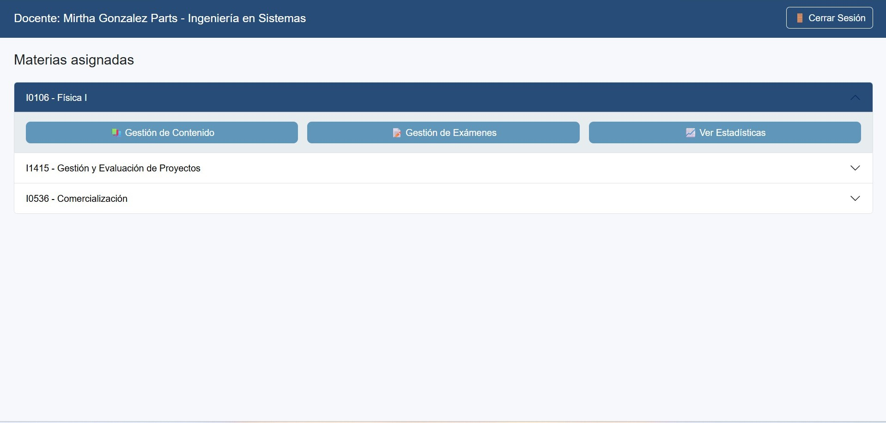

1.	Ingresá con tus credenciales institucionales.

2.	La pantalla principal muestra:  

    -	Tu nombre y carrera (barra superior).  

    -	La lista de Materias asignadas (cuerpo de página).  

    -	Botón Cerrar Sesión (arriba a la derecha).  

3. En cada materia verás accesos: Gestión de Contenido, Gestión de Exámenes, Ver Estadísticas.  

{ width="100%" align="center" }