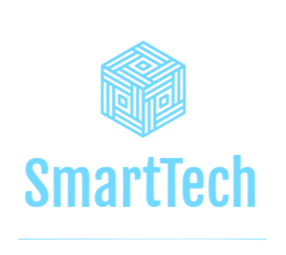

{ style="display:block; margin:auto; width:30%;" }
Smartech está formado por un equipo de estudiantes del último año de Ingeniería en Sistemas comprometidos con la innovación tecnológica aplicada a la educación.  
Nuestro objetivo es desarrollar soluciones inteligentes que faciliten el aprendizaje y optimicen las tareas docentes mediante el uso de inteligencia artificial y herramientas digitales.  
El proyecto Edu 2.0 refleja nuestra visión de una educación universitaria más interactiva, personalizada y accesible.  

# Nuestro equipo
- **Hernán Hereñú — Technical Lead**  
Responsable del diseño e implementación técnica del sistema. Coordina los aspectos tecnológicos del proyecto, define la arquitectura y lidera la integración de los componentes de inteligencia artificial. Su enfoque se centra en la innovación, la eficiencia y la calidad técnica del producto.

- **Macarena Escuer — Project Manager**  
Encargada de la planificación, organización y seguimiento del proyecto. Asegura la comunicación entre las distintas áreas, gestiona los plazos y coordina los recursos para garantizar el cumplimiento de los objetivos. Posee un enfoque estratégico y orientado a resultados.

- **Matías García — Desarrollador**  
Participa activamente en el diseño y desarrollo de las funcionalidades del sistema. Su aporte técnico se destaca en la implementación del backend y la integración de los módulos principales. Aporta soluciones creativas y eficientes para los desafíos del desarrollo.

- **Jorge Retamozo — Desarrollador**  
Colabora en la programación del sistema, participando en la codificación, pruebas y documentación. Su perfil proactivo y su interés por el aprendizaje continuo aportan dinamismo y compromiso al grupo.