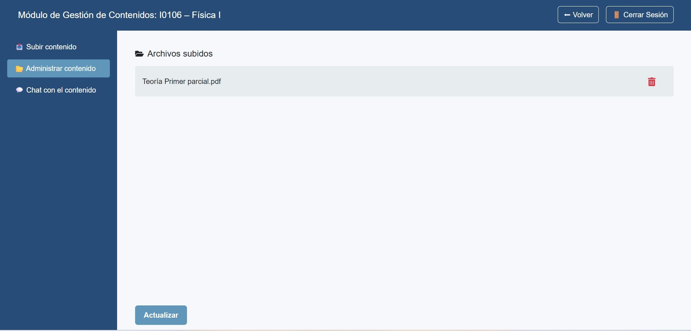

1.	Ir a Administrar contenido.  

2.	Verás el listado de PDFs indexados para la materia.  

3.	Acciones disponibles:  

    -	Eliminar (ícono rojo de papelera) → quita el PDF y sus embeddings asociados.  

    -	Actualizar → reescanea/recarga la lista si subiste o eliminaste algo recientemente.  

 **Buenas prácticas**  

-	Mantener solo las versiones vigentes.  

-	Si reemplazás un apunte, eliminá primero el viejo.  

-	Revisar que los nombres de archivo coincidan con el programa de la materia.  

{ width="100%" align="center" }
