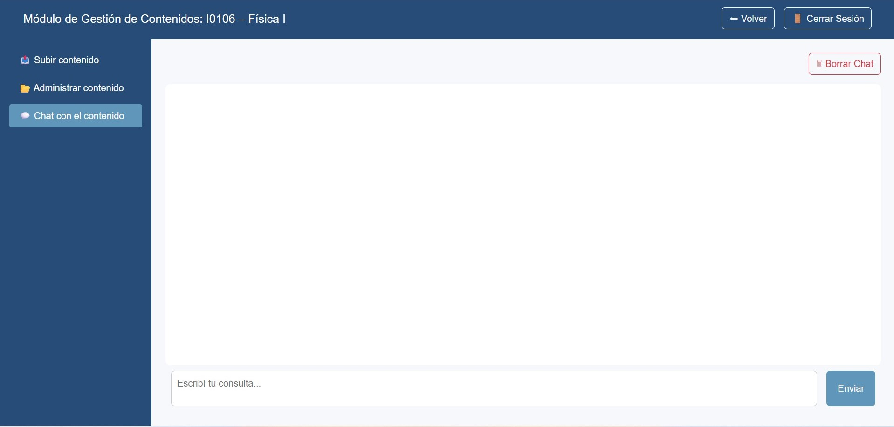

Sirve para verificar que las respuestas de la IA se anclan al material subido.  

1.	Ir a Chat con el contenido.  

2.	Escribir una pregunta (ej.: “¿Cuál es la hipótesis para Bernoulli?”).  

3.	Analizar la respuesta, que debe citar etiquetas / temas del material cargado.  

**Sugerencias**  

-	Probar preguntas al límite (casos borde).  

-	Si la respuesta no es clara, revisar PDF fuente y, de ser necesario, subir una versión mejorada.  

{ width="100%" align="center" }

