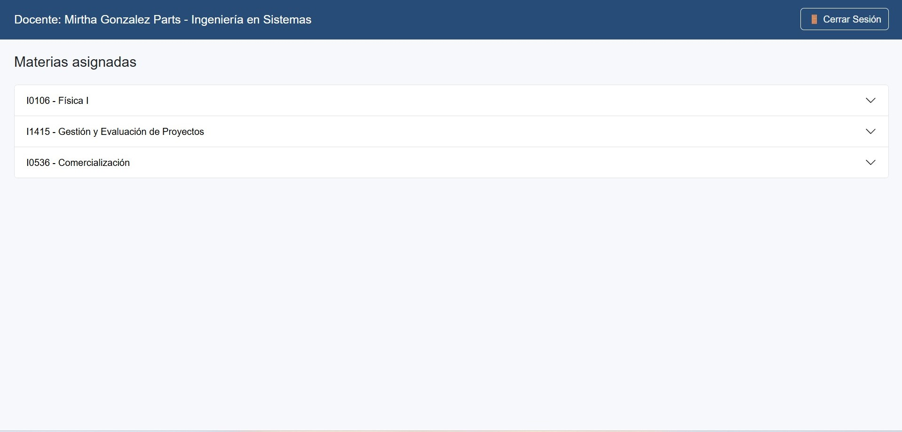

Este manual guía al docente en el uso de Edu 2.0 para:  

 •	Gestionar contenido (subir PDFs, administrar y conversar con el material).  

 •	Crear y administrar exámenes (visibilidad, edición, eliminación).  

 •	Consultar estadísticas (uso, palabras clave, conexiones, rendimiento).  

La interfaz se organiza por materias asignadas y cada módulo tiene un panel lateral con secciones.  

{ width="100%" align="center" }

