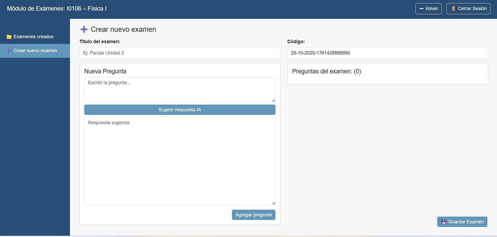

1.	Ir a Crear nuevo examen.  
2.	Completar Título del examen.  
3.	Se genera un Código automáticamente (único).
4.	En Nueva Pregunta:  
    •	Redactar la consigna.  
    •	Opcional: presionar Sugerir respuesta IA para obtener un borrador de respuesta esperada (ayuda a la corrección automatizada).  
    •	Agregar la pregunta a la lista del examen.  
5.	Repetir para todas las preguntas.
6.	Presionar Guardar Examen (queda, por defecto, en visible=false).  

## Tipos de pregunta soportados (según configuración actual)  
•	Respuesta abierta (texto libre).  
•	Elección múltiple (si está habilitado en tu versión).  

## Consejos de diseño  
•	Una pregunta por competencia • subtema.  
•	Enunciados claros con datos suficientes (evitar ambigüedad).  
•	Si usás Sugerir respuesta IA, revisá y editala antes de guardar.  

{ width="100%" align="center" }