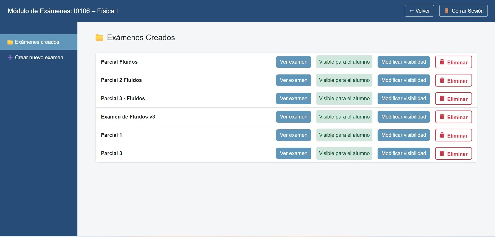

1.	Entrar a Gestión de Exámenes → Exámenes creados.  

2.	En la tabla verás:  

    •	Título del examen (p. ej. “Parcial 2 Fluidos”).  

    •	Botón Ver examen (muestra el detalle/preguntas).  

    •	Estado: Visible para el alumno (verde) • no visible.  

    •	Modificar visibilidad (publicar/ocultar).  

    •	Eliminar (borra el examen y sus preguntas).  

## **Flujo recomendado de publicación**
•	Crear → Revisar → Publicar (Visible para el alumno) → Comunicar a cursada.

{ width="100%" align="center" }