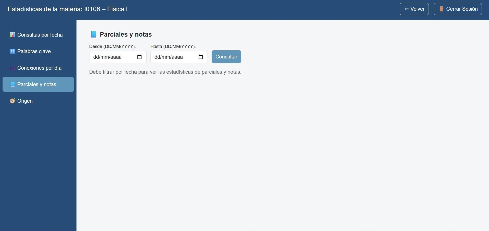
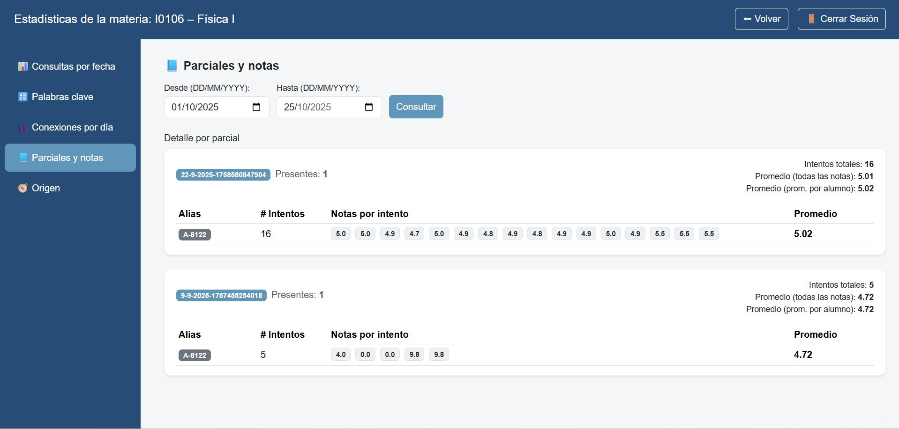

-	Resumen de desempeño por evaluación (promedios, dispersión si está disponible).  

-	Útil para retroalimentación y ajuste de dificultad.  

-	Posee filtro por fecha para refinar la consulta.

{ width="50%" align="center" }

{ width="50%" align="center" }

