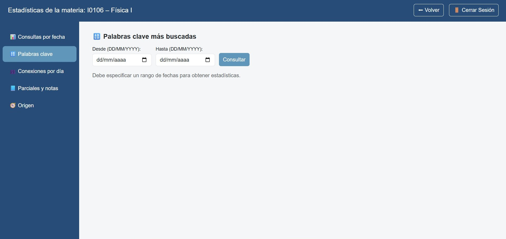
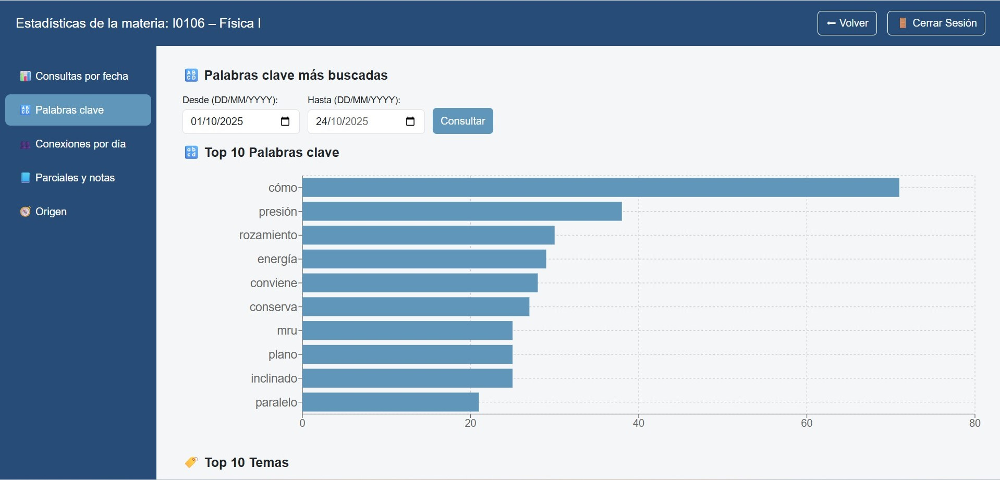

-	Top 10 de términos más consultados.  

-	Sirve para priorizar apuntes o crear guías de temas más demandados.  

-	Posee filtro por fecha para refinar la consulta.

{ width="50%" align="center" }

{ width="50%" align="center" }
