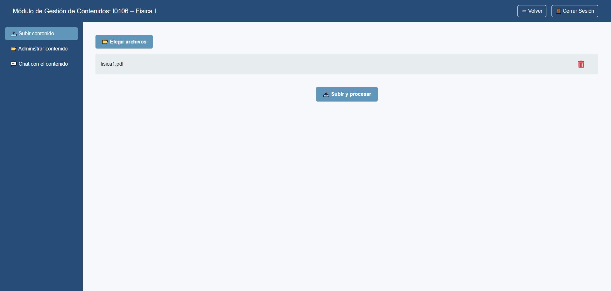

1.	Ir a Subir contenido.  

2.	Presionar Elegir archivos o arrastrar y soltar PDFs.  

3.	Confirmar la subida; el sistema procesa los archivos:  

    •	Extrae texto, tokeniza, genera embeddings y guarda el contexto por materia.  

    •	Muestra mensajes de estado / barra de progreso.  

4.	Al finalizar la indexación, el contenido queda disponible para consultas (IA y alumnos).  

**Recomendaciones**  

•	Usar nombres descriptivos (ej.: Teoría Unidad 2 - Fluidos.pdf).

•	Evitar PDFs escaneados sin OCR.  

•	Tamaño sugerido por archivo: < 50 MB.  

{ width="100%" align="center" }
